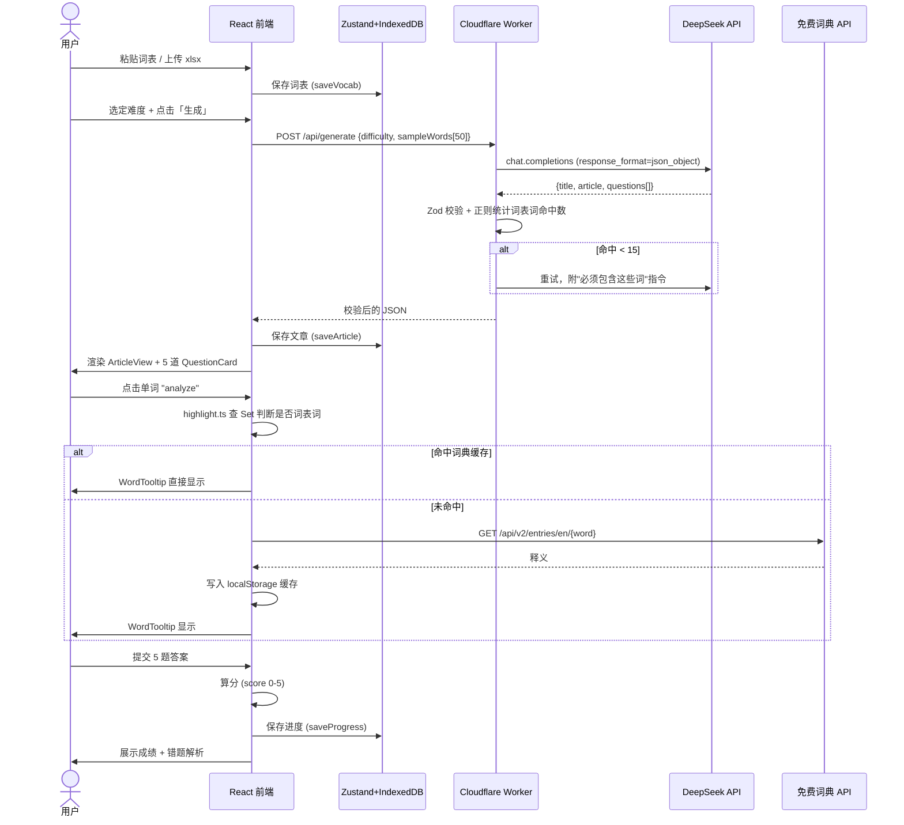
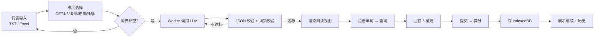

# PRD — 英语阅读巩固训练工具

**产品暂定名**：Readai / 词遇读
**文档版本**：v1.0（已锁定）
**最后更新**：2026-07-30
**状态**：✅ 已审批 + ✅ v1.0 实现说明已追加，待编码实现

---

## 0. v1.0 实现说明（Implementation Notes · 2026-07-30）

下文 §3 已锁定 V1 MVP 的 7 项核心功能、§4 已锁定 10 条业务规则、§5 已锁定数据契约、§6 已选定"B 任务卡片式"原型。本节仅补充实现层面的**新增内容**，不替代原有锁定条款。

### 0.1 本次实现新增产物（相对 §6/§7 的细化）

| 模块 | 新增内容 |
|---|---|
| **原型图** | 增加「导入向导」「阅读做题二合一页」「历史记录页」三张 ASCII 线框 |
| **目录结构** | 新增 `worker/` 子项目（Cloudflare Workers 单文件 BFF） |
| **配置** | 新增 `worker/wrangler.toml`、`.dev.vars.example`、`.env.example` |
| **类型与契约** | 新增 `src/types/domain.ts` 领域模型类型（与 §5 一致） |
| **词典 LRU** | 新增 `src/lib/dictLRU.ts` 简单的 500 条 LRU |
| **Worker 路由** | `POST /api/generate`、`GET /api/dict/:word`、`GET /healthz` |
| **限流** | Worker KV 计数 + 前端按钮 3s 防抖 |
| **降级** | DeepSeek 429 → 自动切换 Moonshot；两者都失败 → 友好错误 |

### 0.2 ASCII 原型图（本次实现版）

#### 0.2.1 首页 Dashboard（任务卡片式 · 与 §6 锁定一致）

```
┌─────────────────────────────────────────────────────────────────┐
│  词遇读  · 雅思                                       👤 无账号  │
├─────────────────────────────────────────────────────────────────┤
│  ┌──────────┐ ┌──────────┐ ┌──────────┐ ┌──────────┐           │
│  │📚 词表     │ │✨ 生成阅读  │ │📊 历史    │ │⚙ 设置     │          │
│  │ 812 词    │ │ ✓ 已就绪   │ │ 7 篇     │ │ 雅思      │          │
│  │[管理]     │ │[开始生成]  │ │[查看]    │ │[打开]    │          │
│  └──────────┘ └──────────┘ └──────────┘ └──────────┘           │
│                                                                 │
│  ┌───────────────────────────────────────────────────────────┐  │
│  │  ⓘ  词表已就绪（812 词） · 难度：雅思 · 最近文章 2026-07-30 │  │
│  └───────────────────────────────────────────────────────────┘  │
└─────────────────────────────────────────────────────────────────┘
```

#### 0.2.2 词表导入向导

```
┌──────────────────────────────────────────────────────────────┐
│  ← 词表导入                                            第 1/2 步│
├──────────────────────────────────────────────────────────────┤
│  ⓘ  支持 TXT（每行一词 / 空格分隔） / .xlsx（一列）              │
│                                                              │
│   [TXT 粘贴]   [Excel 上传]      ← Tab 切换                     │
│  ┌────────────────────────────────────────────────────────┐  │
│  │ analyze                                                │  │
│  │ data                                                   │  │
│  │ pattern                                                │  │
│  │ ...                                                    │  │
│  └────────────────────────────────────────────────────────┘  │
│                                                              │
│   已识别 100 个词 · 去重后 98 个 · 跳过 2 个无效                  │
│                                                              │
│                            [取消]  [预览 →]                    │
└──────────────────────────────────────────────────────────────┘

                            ↓ 预览

┌──────────────────────────────────────────────────────────────┐
│  ← 词表预览                                            第 2/2 步│
├──────────────────────────────────────────────────────────────┤
│   总计 98 词  ·  来源: pasted 80  ·  xlsx 18                    │
│                                                              │
│   ┌────────┬─────────────┬──────────┐                         │
│   │ #      │ 原词         │ 归一化     │ 来源    │              │
│   ├────────┼─────────────┼──────────┤                         │
│   │ 1      │ Analyze     │ analyze  │ pasted │              │
│   │ 2      │ "data"      │ data     │ xlsx   │              │
│   │ 3      │ pattern.    │ pattern  │ pasted │              │
│   │ ...    │             │          │        │              │
│   └────────┴─────────────┴──────────┘                         │
│                                                              │
│                     [← 返回]   [✓ 确认入库]                    │
└──────────────────────────────────────────────────────────────┘
```

#### 0.2.3 阅读 + 做题页（§6 锁定样式 · 加上工具栏与悬浮词典）

```
┌─────────────────────────────────────────────────────────────────┐
│  ← 返回首页                              雅思 · The Hidden ...  │
├──────────────────────────────────┬──────────────────────────────┤
│  工具栏: 字号 A- A+ | 全屏 ⤢       │  📝 题目 1 / 5              │
│                                   │                              │
│  Marine biologists have spent     │  文章主旨最接近？              │
│  decades trying to [analyze] the  │  ○ A. 介绍海洋生物学家         │
│  complex movements of ocean       │  ○ B. 揭示洋流中一个隐藏模式   │
│  currents. Recent [data]          │  ○ C. 批评卫星数据收集方法      │
│  collected by satellite            │  ○ D. 比较不同海洋现象         │
│  [reveals] a surprising            │                              │
│  [pattern]...                     │     [← 上一题]   [下一题 →]   │
│                                   │                              │
│  ━━━━━━━━━━━━━━━━━━━━━━━━━━━━━━ │                              │
│  📖 词典：点击任意单词唤起 →               │   ✓ 进度 0 / 5   已答      │
│                                   │                              │
│  ┌─ Tooltip (悬浮) ─────────────┐ │                              │
│  │ analyze  v. 分析；分解          │ │                              │
│  │ ✓ 已掌握（来自你的词表）        │ │                              │
│  └─────────────────────────────┘ │                              │
│                                   │                              │
│                  [✓ 提交答卷]    │                              │
└───────────────────────────────────┴──────────────────────────────┘
```

#### 0.2.4 成绩与历史页

```
┌──────────────────────────────────────────────────────────────┐
│  ✓ 评分：4 / 5                                              │
├──────────────────────────────────────────────────────────────┤
│  Q1 ✓   B   你选了 B ✓                                          │
│  Q2 ✗   A   你选了 C ✗   正确：A   出处：第 3 段第一句             │
│  Q3 ✓   D   你选了 D ✓                                          │
│  Q4 ✓   A   你选了 A ✓                                          │
│  Q5 ✓   B   你选了 B ✓                                          │
│                                                              │
│  词表词复现：17 个   ·   ▆▆▆▆▆▆▆▆▆▆▆▆▆▆▆▆▇                       │
│                                                              │
│  [再看一次]  [← 返回首页]                                      │
└──────────────────────────────────────────────────────────────┘

─── 历史列表 ───────────────────────────────────────────────────
┌──────────────────────────────────────────────────────────────┐
│  # │ 标题                   │ 难度  │ 得分  │ 完成时间            │
│  1 │ The Hidden Pattern...  │ 雅思  │ 4 / 5 │ 2026-07-30 16:42   │
│  2 │ Why Coral Reefs ...    │ 雅思  │ 3 / 5 │ 2026-07-30 12:08   │
│  ...                                                          │
└──────────────────────────────────────────────────────────────┘
```

### 0.3 本次实现技术架构（与 §7.1 一致 + 增补）

**目录结构（落地版）：**
```
.
├── Prd.md
├── package.json                 # 前端 + 构建
├── vite.config.ts
├── tailwind.config.js
├── tsconfig.json
├── index.html
├── .env.example                 # VITE_WORKER_URL
├── worker/                      # Cloudflare Workers (BFF)
│   ├── wrangler.toml
│   ├── package.json
│   ├── .dev.vars.example        # DEEPSEEK_API_KEY / MOONSHOT_API_KEY
│   └── src/
│       └── index.ts             # POST /api/generate, GET /api/dict/:w
└── src/                         # React 前端
    ├── main.tsx
    ├── App.tsx
    ├── index.css                # tailwind
    ├── types/
    │   └── domain.ts            # §5 数据契约 TS 类型
    ├── lib/
    │   ├── schemas.ts           # Zod 校验
    │   ├── vocab.ts             # TXT / xlsx 解析 + 归一化
    │   ├── highlight.ts         # 文章 → token → 高亮
    │   ├── storage.ts           # idb-keyval 封装
    │   ├── llm.ts               # fetch /api/generate
    │   ├── dict.ts              # 词典查询 + LRU
    │   └── utils.ts             # 防抖 / uid / 格式化
    ├── store/
    │   └── useAppStore.ts       # Zustand
    ├── components/
    │   ├── VocabImporter.tsx
    │   ├── DifficultyPicker.tsx
    │   ├── ArticleView.tsx
    │   ├── WordTooltip.tsx
    │   ├── QuestionCard.tsx
    │   └── ui/
    │       ├── Button.tsx
    │       ├── Toast.tsx
    │       └── Skeleton.tsx
    └── pages/
        ├── HomePage.tsx
        ├── ReadingPage.tsx
        ├── HistoryPage.tsx
        └── VocabPage.tsx
```

**新增/调整的关键点：**
1. **Worker KV 限流**：`wrangler.toml` 声明 `[[kv_namespaces]]`，运行时按 IP 计数（10/min、100/天）。
2. **词典 LRU**：`src/lib/dict.ts` 维护内存 Map + localStorage 持久化，上限 500。
3. **降级切换**：Worker 内 `safeCallLLM()` 捕获 429/5xx 时顺序尝试 deepseek → moonshot。
4. **前端按钮防抖**：生成按钮 `debounce(3000)`。
5. **类型与 schema 单一来源**：`src/lib/schemas.ts` 用 `z.infer` 同时导出 TS 类型，与 `src/types/domain.ts` 保持等价。

### 0.4 实施步骤（本次实现的执行序列）

| # | 内容 | 输出 |
|---|------|-----|
| 1 | 脚手架 + Tailwind | dev 能跑通 |
| 2 | 类型/Schema/Storage | 可保存词表、可读出 |
| 3 | 词表导入 UI | 粘贴 + xlsx + 预览 |
| 4 | 难度选择 + Dashboard | 首页可显示 4 张卡 |
| 5 | Worker 入口 + LLM | 浏览器能命中 Worker |
| 6 | Worker 校验 + 重试 | 不达标自动重试 |
| 7 | Article 渲染 + 高亮 | 单词可点 |
| 8 | 词典 Tooltip | 翻译可显示 |
| 9 | 答题 + 评分 + 进度 | 能算 0~5 分 |
| 10 | 历史页 | IndexedDB 列表 |
| 11 | 错误兜底 + Loading | 5 类异常都友好 |
| 12 | 自检 + 构建 | `tsc --noEmit`、`npm run build` |

---

## 1. 核心目标 (Mission)

**让中国英语学习者在"基于自己已背单词"的真实语境阅读中，巩固所学词汇，告别"背了就忘"。**

---

## 2. 用户画像 (Persona)

| 维度 | 描述 |
|---|---|
| **典型用户** | 备考 CET-4/6、考研、雅思、托福的中国学生，年龄 18-26 岁 |
| **使用场景** | 宿舍、图书馆、通勤路上；手机/电脑均可（V1 仅 Web 端） |
| **当前痛点** | ① 在「不背单词/百词斩」上背了几千词，真正阅读时却认不出来；② 通用英语阅读材料生词太多，挫败感强；③ 想做阅读理解题，但找不到"难度刚好"的题源 |
| **现有方案不足** | Quizlet/百词斩：只能机械重复单词；普通英语阅读网站：难度不可控、与用户词库无关 |
| **核心期望** | "我想读一篇**用我已经背过的词写出来**的文章，再用它做几道阅读题加深印象" |

---

## 3. 产品路线图

### V1: MVP（数天上线）

**必须包含的核心功能：**

1. **词表导入**：支持 TXT 粘贴 + Excel (.xlsx) 上传
   - 自动去重、清洗、归一化（小写、去音标、去例句残留）
   - 导入前展示预览表，用户确认后才入库
2. **难度选择**：CET-4 / CET-6 / 考研 / 雅思 / 托福 五档单选
3. **AI 生成阅读题**：调用 LLM（DeepSeek 主、Moonshot 备）一次性生成
   - 1 篇 ~300 词英文阅读
   - 5 道阅读理解选择题（中文题干）
   - **强约束**：词表中至少 15 个词自然出现在文中（后端正则校验 + 不达标自动重试）
   - **强制 JSON 结构化输出**
4. **沉浸式阅读视图**：每个单词是独立 span，支持点击唤起翻译 tooltip
   - 已掌握词（词表内）：绿色徽章 "已掌握"
   - 生词：蓝色徽章 "新词"
   - 翻译来源：免费词典 API + 本地 LRU 缓存
5. **阅读理解答题 + 评分**：5 题全必答，提交后展示每题对错与解析（题目原文出处）
6. **历史记录**：本地 IndexedDB 存储过往生成的文章与得分，可重新查看
7. **数据本地化**：无账号、无云端；全部走 localStorage / IndexedDB（最快上线）

### V2 及以后

- **V2.0** PDF 智能识别（含 OCR，处理扫描件）
- **V2.1** Word (.docx) 解析
- **V2.2** 完形填空模式（抹去 5-10 词让用户选词填空）
- **V2.3** 词汇巩固测验（看中文拼英文 / 选词义）
- **V3.0** 用户账号 + 云端同步 + 多设备
- **V3.1** 学习数据看板（每日阅读量、词汇复现率、得分趋势）
- **V3.2** 移动端 PWA / 响应式优化
- **V3.3** 主题切换（科技/学术/故事等不同语料风格）

---

## 4. 关键业务规则 (Business Rules)

| # | 规则 | 说明 |
|---|---|---|
| BR-01 | 词表归一化 | 全部小写、去前后空白、去标点（如 `analyze.` → `analyze`） |
| BR-02 | 词表去重 | 同一词仅保留一次，按首次出现的来源标注 `pasted` / `xlsx` |
| BR-03 | 难度与词表解耦 | 难度由用户显式选定，不从词表自动推算（避免复杂度） |
| BR-04 | 生成词频约束 | 文章必须包含 ≥15 个词表词；后端正则统计，不达标自动重试（最多 2 次） |
| BR-05 | JSON 严格性 | LLM 必须返回 `response_format: json_object`，后端用 Zod 二次校验 |
| BR-06 | 答题强制完整 | 必须答完 5 题才能提交；提交前不展示正确答案 |
| BR-07 | 翻译缓存 | 同一单词的翻译查询结果本地缓存，避免重复请求 |
| BR-08 | 速率限制 | Worker 端每 IP 每分钟 10 次、每日 100 次，防止滥用与成本失控 |
| BR-09 | 隐私 | 无账号、无云端；用户清浏览器数据即"注销" |
| BR-10 | 错误兜底 | LLM 调用失败 / 超时 → 友好提示 + 一键重试，绝不卡死 |

---

## 5. 数据契约 (Data Contract)

```typescript
type Difficulty = 'CET4' | 'CET6' | '考研' | '雅思' | '托福';

interface Word {
  text: string;          // "Analyzing"
  normalized: string;    // "analyzing"
  source: 'pasted' | 'xlsx';
  addedAt: number;
}

interface VocabularyList {
  id: string;
  difficulty: Difficulty;
  words: Word[];
  createdAt: number;
}

interface Question {
  question: string;                          // 中文题干
  options: [string, string, string, string];  // 4 个选项
  answer: 0 | 1 | 2 | 3;                      // 正确选项下标
}

interface Article {
  id: string;
  title: string;
  article: string;             // 纯英文正文
  questions: Question[];       // 固定 5 道
  difficulty: Difficulty;
  vocabHitIds: string[];       // 实际出现在文中的词表词 id
  createdAt: number;
}

interface UserProgress {
  articleId: string;
  answers: (number | null)[];  // 长度 5
  score: number;               // 0-5
  completedAt: number;
}
```

**存储键约定：**

| Key | 介质 | 用途 |
|---|---|---|
| `vocab:current` | IndexedDB | 当前激活的词表 |
| `article:{id}` | IndexedDB | 已生成的阅读文章 |
| `progress:{articleId}` | IndexedDB | 答题记录 |
| `dict:{word}` | localStorage | 词典查询 LRU 缓存 |
| `settings:difficulty` | localStorage | 上次选择的难度 |

---

## 6. MVP 原型（已选定：B 任务卡片式）

### ✅ 选定方案：B「任务卡片式」— Dashboard + 左右分栏

**设计主张**：把"导入 / 生成 / 阅读 / 做题"做成可独立操作的卡片模块，类似 Notion 工作台。

**设计理由**：
- 模块边界清晰，每个卡片职责单一
- 词典常驻右侧便于查词，不打断阅读
- 生成状态、词表规模、历史数量在一屏内一目了然
- 符合"工具型产品"的心智模型

```
┌────────────────────────────────────────────────────────────┐
│  词遇读  · 雅思                                👤 (无账号)   │
├────────────────────────────────────────────────────────────┤
│  ┌──────────┐ ┌──────────┐ ┌──────────┐ ┌──────────┐        │
│  │📚 词表    │ │✨ 生成阅读│ │📊 历史   │ │⚙ 设置   │        │
│  │ 812 词    │ │ 已就绪    │ │ 7 篇    │ │          │        │
│  │[管理]     │ │[开始生成] │ │[查看]   │ │[打开]   │        │
│  └──────────┘ └──────────┘ └──────────┘ └──────────┘        │
│                                                            │
│  ┌─────────────────────────┬────────────────────────────┐  │
│  │ The Hidden Pattern...   │ 📝 题目 1/5                │  │
│  │                         │                            │  │
│  │ Marine biologists have  │ 文章主旨最接近？             │  │
│  │ spent decades trying    │ ○ A. 介绍海洋生物学家       │  │
│  │ to [analyze] the complex│ ○ B. 揭示洋流中一个隐藏模式 │  │
│  │ movements of ocean      │ ○ C. 批评卫星数据收集方法   │  │
│  │ currents. Recent [data] │ ○ D. 比较不同海洋现象       │  │
│  │ collected by satellite  │                            │  │
│  │ [reveals] a surprising  │       [上一题]   [下一题]   │  │
│  │ [pattern]...            │                            │  │
│  │                         │  📖 词典：[analyze] v.分析  │  │
│  │ [划词: analyze ▼]       │       ✓ 已掌握               │  │
│  └─────────────────────────┴────────────────────────────┘  │
└────────────────────────────────────────────────────────────┘
```

**优点**：模块清晰、随时切题、词典常驻右侧便于查词。
**已知短板**：屏幕占用大，移动端会拥挤——列为 V3.2 响应式优化任务。

---

### 📚 备选方案（仅供对比参考）

**A「沉浸阅读流」** — 单列纵深，类 Medium/Kindle 阅读体验。
- 优点：沉浸感最强
- 缺点：答题需滚动
- *未选用*

**C「分步向导式」** — 全屏分步：导入 → 配置 → 阅读 → 做题 → 结果。
- 优点：流程最清晰
- 缺点：来回跳转多，不够沉浸
- *未选用*

---

## 7. 架构设计蓝图

### 7.1 技术选型

| 层 | 选型 | 理由 |
|---|---|---|
| 前端框架 | **Vite + React + TypeScript** | 一行命令脚手架，热更新快，无 SSR 复杂度 |
| 样式 | **Tailwind CSS v3** | 中文文档成熟，小白友好 |
| 状态管理 | **Zustand** | 3 行模板代码搞定，比 Redux 简单 10 倍 |
| Excel 解析 | **SheetJS (`xlsx`)** | 纯 JS、浏览器跑、.xlsx/.xls/CSV 通吃 |
| 本地存储 | **idb-keyval** | 3KB 包装 IndexedDB 的 Promise API |
| LLM 校验 | **Zod** | 运行时类型校验，挡掉 LLM 的脏 JSON |
| 后端（BFF） | **Cloudflare Workers** | 免费 100k 请求/天、单文件部署、不用管服务器 |
| 主 LLM | **DeepSeek `deepseek-chat`** | ¥1/M tokens、支持 `response_format: json_object`、中文友好 |
| 备用 LLM | **Moonshot `moonshot-v1-8k`** | 同 OpenAI 兼容协议，DeepSeek 429 时切换 |
| 词典 API | `api.dictionaryapi.dev`（免费，无需 key） | 起步够用；后期可换百度翻译 |

### 7.2 核心流程图

**序列图（Sequence Diagram）**



**流程图（Flowchart）**



### 7.3 组件交互说明（关键文件）

| 文件 | 类型 | 职责 |
|---|---|---|
| `worker/src/index.ts` | 新增（Worker 入口） | LLM 代理 + Zod 校验 + 重试 |
| `src/lib/prompt.ts` | 新增 | 拼装 LLM 提示词 |
| `src/lib/llm.ts` | 新增 | 前端调用 Worker 的 fetch 封装 |
| `src/lib/highlight.ts` | 新增 | 文章分词 + 词表匹配 |
| `src/lib/vocab.ts` | 新增 | TXT / Excel 解析 + 归一化 |
| `src/lib/schemas.ts` | 新增 | Zod schema + TS 类型 |
| `src/lib/storage.ts` | 新增 | IndexedDB 封装 |
| `src/store/useAppStore.ts` | 新增 | Zustand 全局 store |
| `src/components/VocabImporter.tsx` | 新增 | 词表导入 UI |
| `src/components/DifficultyPicker.tsx` | 新增 | 难度选择器 |
| `src/components/ArticleView.tsx` | 新增 | 文章渲染（单词 span） |
| `src/components/WordTooltip.tsx` | 新增 | 翻译气泡 |
| `src/components/QuestionCard.tsx` | 新增 | 单题卡片 |
| `src/pages/HomePage.tsx` | 新增 | 首页 / Dashboard |
| `src/pages/ReadingPage.tsx` | 新增 | 阅读 + 做题页 |
| `src/pages/HistoryPage.tsx` | 新增 | 历史文章 |

**模块调用关系：**
- `pages/*` → 调用 `components/*` 和 `store/useAppStore`
- `components/*` → 调用 `lib/*` 中的纯函数
- `lib/llm.ts` → fetch Worker 端点
- `worker/src/index.ts` → 直接调 DeepSeek SDK

### 7.4 关键技术风险与缓解

| 风险 | 等级 | 缓解策略 |
|---|---|---|
| LLM 返回非法 JSON | 中 | `response_format: json_object` + Zod 解析 + 失败自动重试一次 |
| 词表词复现率 < 15 | 高 | Worker 正则统计，< 15 自动追加 "必须包含这些词" 重试（最多 2 次） |
| API Key 泄露 | **高** | **禁止前端直连**，必须经 Worker；Worker 内置每 IP 限流（10/分钟、100/天） |
| Excel 解析边界 | 低 | 用 `sheet_to_json({defval:''})` 兜底空值，跳过表头，导入前预览 |
| 词典 API 限流 | 中 | localStorage LRU 缓存 500 条；用户手动关掉弹窗时不再请求 |
| DeepSeek 偶发 429 | 低 | 自动切换 Moonshot 备用 |
| 用户疯狂点击「生成」导致成本 | 中 | Worker 限流 + 前端按钮加 3 秒防抖 |
| Worker 冷启动慢 | 低 | 首次部署后预热 |

### 7.5 验证方案（手动测试计划）

**Phase 1 — 脚手架（第 1 天上午，2 小时）**
1. `git init && npm create vite@latest . -- --template react-ts`
2. `npm install` → `npm run dev` → 浏览器打开 `localhost:5173` 确认 React 启动
3. 提交 `init`

**Phase 2 — 词表导入（第 1 天下午）**
1. 粘贴 100 个测试词 → 计数器显示 100 → 刷新页面 → 数据仍在
2. 上传一个真实 `.xlsx` → 预览表显示 → 点保存

**Phase 3 — LLM 代理（第 2 天上午）**
1. `worker/.dev.vars` 写入 `DEEPSEEK_API_KEY`
2. `npx wrangler dev` 起 Worker
3. `curl -X POST localhost:8787/api/generate -d '{"difficulty":"雅思","vocab":["analyze","data"]}'`
4. 确认返回有效 JSON，含 5 题

**Phase 4 — 完整流程（第 2 天下午）**
1. 前端联调 Worker，生成一篇雅思阅读
2. 确认 ≥15 个词表词高亮显示
3. 点击任意单词 → tooltip 弹出 + 绿色/蓝色徽章正确
4. 答完 5 题 → 提交 → 看到分数与错题解析

**Phase 5 — 打磨与部署（第 3 天）**
1. UI 抛光（Loading、骨架屏、错误提示）
2. `wrangler deploy` 部署 Worker
3. 前端 `npm run build` → Vercel/Netlify 部署
4. 分享给 1 个朋友无账号试跑

---

## 8. 审批记录

| 项目 | 状态 |
|---|---|
| 使命与用户画像 | ✅ 已确认 |
| V1 MVP 功能清单（7 项） | ✅ 已确认 |
| V2+ 路线 | ✅ 已确认 |
| 业务规则 10 条 | ✅ 已确认 |
| 数据契约 5 个核心接口 | ✅ 已确认 |
| MVP 原型方案 | ✅ 已选定 B「任务卡片式」 |
| 技术栈（Vite+React+TS / Cloudflare Workers / DeepSeek） | ✅ 已确认 |
| 架构流程图 | ✅ 已确认 |
| 风险与缓解 | ✅ 已确认 |

---

**📦 此文档已存档为正式 PRD。下一步等待用户指令（开始实现 / 调整 PRD / 其他）。**